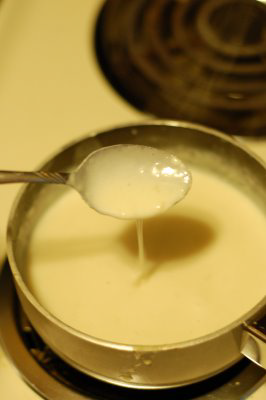

# Mornay sauce

*You can coat poached eggs, fish, vegetables and white meats with this sauce, then brown under a hot grill. This sauce can also be mixed with macaroni cheese.*

**Servings:** 4

## Ingredients
- 500 ml [Béchamel Sauce](./bechamel-sauce.md)
- 1 Pinch nutmeg
- 1 pinch salt and pepper
- 3 egg yolks
- 50 ml double cream
- 100 grams Gruyere cheese (finely grated)

## Method
1. Mix the egg yolks and cream together in a bowl, then pour the mixture into the béchamel, whisking all the time.
1. Let the sauce bubble for about 1 minute, whisking continuously.
1. Take the pan off the heat and shower in the grated cheese. 
1. Stir until melted, then taste and adjust the seasoning if necessary.