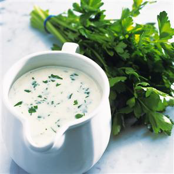

# Parsley sauce

*This sauce goes well with Brussels sprouts, carrots or potatoes. You can enrich the sauce with cream or butter, and serve with fish.*

**Servings:** 4

## Ingredients
- 20 grams butter
- 20 grams plain flour
- 150 ml milk
- 350 ml ham or chicken stock
- 2 tablespoons fresh parsley (chopped)
- 1 pinch nutmeg (freshly grated)
- 1 pinch salt and pepper

## Method
1. Melt the butter in a small, heavy based saucepan over a low heat, then add the flour. 
1. Stir with a whisk, and cook gently for 2-3 minutes to make a white roux. Pour the cold milk on to the roux, mixing as you do so, then whisk in the stock. 
1. Bring to the boil over a medium heat, whisking continuously as the sauce begins to bubble.
1. Add the parsley and simmer the sauce for 15 minutes, skimming the surface with a spoon if necessary. 
1. Season with nutmeg, salt and pepper then serve piping hot.