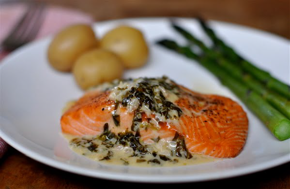

# Sorrel sauce

*With its hint of acidity, this sauce is ideal for serving with fish cakes or pan-fried lamb chops. A few shredded mint leaves added to the sauce just before serving intensifies the taste of the sorrel and gives the sauce a more rounded flavour.*

*This sauce can be made into a foam, or simply poured.*

**Servings:** 6

## Ingredients
- 60 grams sorrel
- 30 grams butter
- 40 grams shallots (finely chopped)
- 100 ml white wine
- 200 ml vegetable stock
- 200 ml double cream
- 1 pinch salt and pepper 

## Method
1. Wash the sorrel and remove the stalks. Pile up several leaves, roll them up like a cigar and shred them finely. 
1. Repeat until you have shredded the sorrel.Melt the butter in a deep frying pan, and add the shallot and sweat over a low heat for 30 seconds, then tip in the sorrel and sweat gently for another minute.
1. Pour in the white wine and vegetable stock and reduce the liquid by 2/3. 
1. Add the cream and bubble for 2 minutes. 
1. The sauce should be thick enough to coat the back of the spoon lightly. Season with salt and pepper to taste and serve at once.