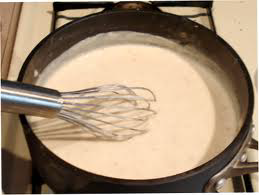

# Soubise sauce

*A variant of béchamel sauce that has a slightly sweet taste from sweated onions, and goes well with white meat or veal.*

**Servings:** 4

## Ingredients
- 300 ml [Béchamel Sauce](./bechamel-sauce.md)
- 40 grams butter
- 200 grams onion (thinly sliced)
- 150 ml double cream
- 1 pinch salt and pepper
- half a teaspoon of nutmeg (freshly ground)

## Method
1. Melt the butter in a saucepan over a low heat, add the onions and sweat for 5 minutes without colouring. 
1. Add the béchamel sauce, bring to the boil over a low heat and allow to bubble for 10 minutes, stirring frequently.
1. Pass through a fine-meshed sieve into a clean saucepan, pressing the onions with the back of a ladle to extract as much flavour as possible.
1. Add the cream and cook gently for 6-8 minutes, stirring continuously, until the sauce has reduced and thickened.
1. Season to taste with salt, pepper and the nutmeg.