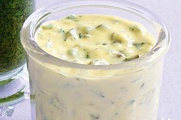

# Tartare Sauce

*Tartare sauce is a classic accompaniment to fried and grilled fish; it is also served with cold fish and shellfish.*

**Servings:** 6

## Ingredients
- 3 egg yolks (hard boiled)
- salt and pepper
- 200 ml groundnut oil
- 1 tablespoon lemon juice
- 20 grams onion (finely chopped, blanched, refreshed and drained)
- 3 tablespoons Mayonnaise
- 1 tablespoon chives (snipped)

## Method
1. Put the hard-boiled egg yolks into a mortar and pound with the pestle to make a smooth paste. 
1. Season with salt and pepper, then incorporate the groundnut oil in a thin stream, stirring continuously with the pestle.
1. When the oil is all incorporated, add the lemon juice, then the onion and mayonnaise. 
1. Stir to combine, then add the chives and season with salt and pepper to taste.