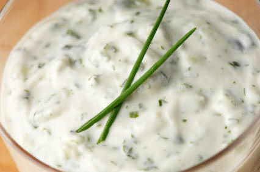

# Tzatziki sauce

*A Greek dip made from yogurt, chopped cucumber, and mint.*

**Servings:** 8

## Ingredients
- 100 ml Greek yoghurt
- 1 tablespoon lemon juice
- 1 clove garlic (crushed)
- 8 cm cucumber (finely grated)
- 2 stalks chives

## Method
1. Mix together the yoghurt, lemon juice and garlic and fold in the grated cucumber. 
1. Refrigerate for at least 30 minutes before serving.
1. Decorate with crossed stalks of the chives.