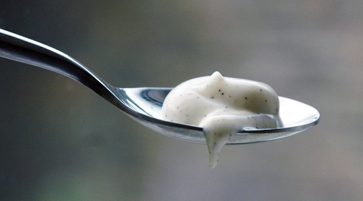

# Vanilla mayonnaise

*This is a light mayonnaise, due to the fact that it uses the egg whites as well as the yolk. It works especially well with liquorice poached salmon.*

## Ingredients
- 1 Large egg yolk
- 1 whole large egg
- 15 grams Dijon mustard
- 5 grams salt
- seeds from 2 vanilla pods
- 350 grams groundnut oil
- 20 grams white wine vinegar

## Method
1. Combine the eggs, mustard, salt and vanilla seeds in a bowl.
1. Using a hand whisk, mix the ingredients together.
1. Slowly add in the oil, a little at a time.
1. When the mayonnaise begins to emulsify, pour in the oil in a steady stream making sure you keep whisking.
1. When the mayonnaise has emulsified, stir in the vinegar.
1. This will keep in the fridge for up to 2 days.