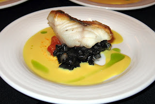

# Vermouth sauce

*A rich creamy, succulent sauce the goes perfect with braised white fish or shellfish.*

**Servings:** 

## Ingredients
- 40 grams shallots (Finely chopped)
- 1 sprig thyme
- ½ bay leaf
- 100 ml vermouth (dry)
- 300 ml Fish stock
- 2 tablespoons double cream
- 1 pinch paprika
- 60 grams butter (well chilled and diced)
- salt and pepper

## Method
1. Put the shallot, thyme, bay leaf and vermouth into a saucepan and let bubble to reduce by one-third over a high heat.
1. Pour in the fish stock and cook over a medium heat for 10 minutes, then add the cream. 
1. Reduce the sauce over a high heat until it is thick enough to coat the back of a spoon.
1. Remove the thyme and the bay leaf, then whisk in the paprika and turn the heat down to low, making sure that the sauce does not boil. 
1. Whisk in the butter, a little at a time, then season to taste with salt and pepper. 
1. This sauce can be transferred to a blender for 30 seconds to make a foam.