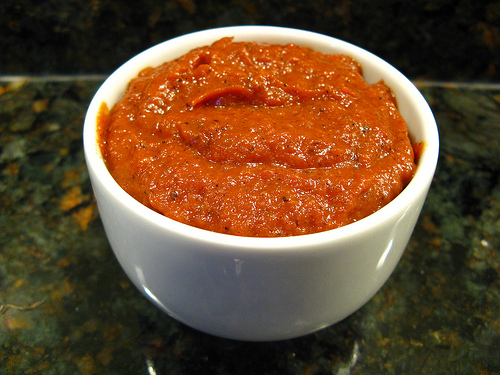

# Chipotle sauce

*The smoky flavour of this rich sauce makes it idea for barbecue-cooked food, either as a marinade or as an accompaniment. It is also wonderful stirred into cream cheese as a sandwich filling, or with chicken. Chipotle chillies are smoke-dried Jalapeños.*

**Serves:** 6

## Ingredients
- 500 grams tomatoes
- 5 chipotle chillies
- 3 garlic cloves (chopped)
- 150 ml red wine
- 1 teaspoon dried oregano
- 4 tablespoons clear honey
- 1 teaspoon American mustard
- half a teaspoon of freshly ground black pepper

## Method
1. Preheat the oven to 200°C.
1. Cut the tomatoes into quarters and place them in a roasting pan.
1. Roast the tomatoes for 45 - 60 minutes, until they are charred.
1. Meanwhile, soak the chillies in a bowl of cold water to cover for about 20 minutes or until they are soft.
1. Remove the stalks, slit the chillies and scrape out the seeds with a small sharp knife. Discard the seeds if necessary.
1. Chop the chillies roughly.
1. Remove the tomatoes from the oven, let them cool slightly and then remove the skins and seeds.
1. Put the tomatoes in a food processor, and purée.
1. Add the chillies, garlic and red wine, and process until the mixture is homogeneous.
1. Add the oregano, honey, mustard and black pepper.
1. Stir to mix, then check for seasoning.
1. Pour the mixture into a small pan.
1. Slowly bring to the boil over a medium heat, then immediately reduce the heat to low and simmer for 10 minutes, stirring occasionally until the sauce has reduced and thickened.
1. This sauce can be served hot or cold.