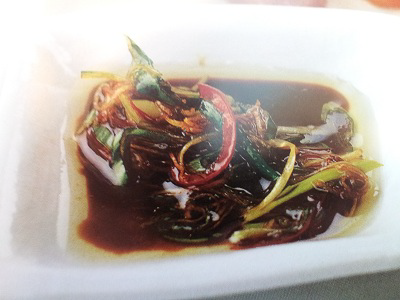

# Ginger and chilli sauce for sashimi

*For sashimi, it is essential to use extremely fresh, good quality salmon and tuna. Cut into diamonds, about 5 mm thick, arrange on a platter and serve with this sauce.*

**Serves:** 8

## Ingredients
- 1 tablespoon fresh ginger (very finely diced)
- 2 tablespoons spring onions (fine julienne)
- 1 red chilli (fine julienne)
- 2 tablespoons dark soy sauce
- 2 tablespoons light soy sauce
- 1 tablespoon unrefined cane sugar
- 2 tablespoons Chicken Stock
- 1 tablespoon sesame oil
- 2 tablespoons groundnut oil

## Method
1. Put all the ingredients, except the oils, into a large bowl. In a small pan, heat the oils to between 80 and 100°C, then pour over the ingredients in the bowl, stirring with a fork.
1. Mix well, then cover the bowl with cling film and leave the sauce to stand for at least 20 minutes before serving.