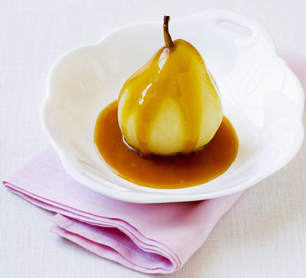

# Butterscotch sauce

*Serve this rich sauce with vanilla ice cream or an apple dessert such as apple Charlotte.*

**Servings:** 8

## Ingredients
- 400 ml single cream
- 120 ml Sirop a sorbet (heavy)
- 75 grams caster sugar
- 1 vanilla pod
- 60 grams unsalted butter (diced)

## Method
1. Pour the cream into a heavy-based saucepan and add the sugar syrup and sugar. 
1. Split the vanilla pod length-ways, scrape out the seeds with the tip of a knife and add them to the pan. 
1. Slowly bring to the boil, stirring continuously.
1. Let the mixture bubble gently, stirring continuously with a small whisk, until it is the colour of pale hazelnuts.
1. Stir in the butter, a little at a time, until completely amalgamated.
1. Serve piping hot.