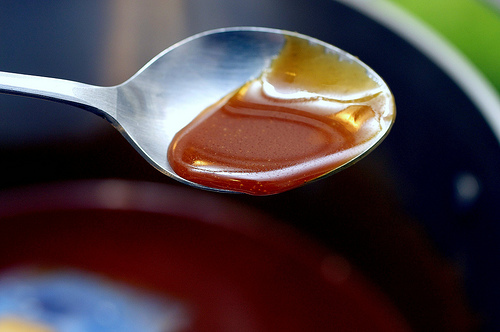

# Caramel sauce

*Caramel sauce makes a delicious accompaniment to numerous desserts. It should be served very cold. It can also be churned in an ice cream maker to make caramel ice cream.*

**Yield:** 700ml

## Ingredients
- 80 ml water
- 100 grams sugar
- 500 ml double cream
- 2 egg yolks lightly beaten(optional)

## Method
1. Pour the water into a large saucepan and add the sugar. 
1. Set over a low heat until the sugar has completely melted and is beginning to boil. 
1. Was down the inside of the pan with a pastry brush dipped in cold water to prevent any crystals from forming. 
1. Cook the sugar until it turns a lovely deep amber colour and the surface begins to smoke slightly. 
1. Take off the heat immediately and beat in the cream, stirring constantly with a whisk.
1. Set the pan back over a high heat and stir with the whisk. 
1. Let the mixture bubble for 2 or 3 minutes, then remove from the heat.
1. Still stirring, pour a little of the sauce onto the egg yolks, then return the mixture to the pan but do not cook it. 
1. Pass the sauce through a conical strainer into a bowl and keep it in a cool place. 
1. Stir the sauce from time to time to prevent a skin from forming.