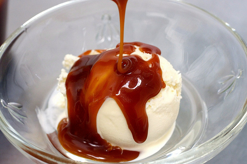

# Caramel with vanilla sauce

*This sauce is delectable drizzled over poached pears or pancakes, or even stirred into natural yoghurt.*

**Servings:** 6

## Ingredients
- 100 grams caster sugar
- 75 grams butter (softened)
- 1 vanilla pod
- 400 ml double cream

## Method
1. Combine the sugar and butter in a heavy-based saucepan.
1. Split the vanilla pod length-ways, scrape out the seeds with the tip of a knife and add them to the pan.
1. Set over a very low heat and stir continuously with a wooden spoon until the sugar has dissolved completely.
1. Continue to cook until the mixture turns an attractive caramel colour.
1. Immediately take the pan off the heat and stir in the cream, protecting your hand with a cloth as the mixture may splutter.
1. Mix well to combine.
1. Return to a medium heat and cook the sauce for 5 minutes, stirring continuously with a wooden spoon.
1. The sauce should be perfectly blended, smooth and shiny.
1. Pass it through a fine-meshed conical sieve and leave to cool.
1. Serve the sauce once it has cooled, or store in a sealed container in the fridge for up to 3 days.