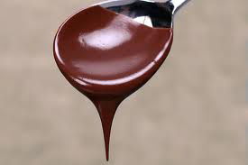

# Chocolate sauce 

*Often used as a topping for various desserts, this sauce can also be used as a base for rich desserts to sit on. Sometimes a pinch of salt, when added to the chocolate can enrich its flavour and enhance the senses.*

**Servings:** 6

## Ingredients
- 200 grams dark chocolate (70% cocoa)
- 175 ml milk
- 2 tablespoons double cream
- 30 grams sugar
- 30 grams butter

## Method
1. Melt the chocolate in a bain-marie.
1. Put the milk, cream and sugar in a saucepan and set over a high heat. 
1. Stir gently with a whisk until the mixture boils. 
1. Pour it onto the melted chocolate, stirring constantly. 
1. Tip the whole mixture into the saucepan and let it bubble for 15 seconds.
1. Take the pan off the heat and beat in the butter, a little at a time, until the sauce is completely homogeneous.
1. Pass through a conical strainer.