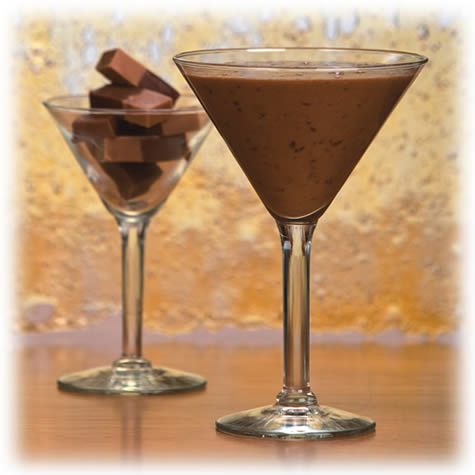

# Coffee sabayon with cinnamon

*This sabayon is delicious as a dessert in itself, served with lacy orange tuiles for contrast, but it also makes a tempting sauce to serve with fresh orange segments or poached pears.*

**Servings:** 4

## Ingredients
- 1 tablespoon instant coffee
- 4 egg yolks
- 50 grams caster sugar
- ½ teaspoon ground cinnamon

## Method
1. For your bain-marie, half fill a saucepan large enough to hold a round-bottomed copper bowl or heatproof glass bowl with warm water. 
1. Place the pan over a low heat.
1. Put the coffee and 4 tablespoons of cold water into the bowl and whisk with a balloon whisk to dissolve. 
1. Lightly whisk in the egg yolks, sugar and cinnamon.
1. Set the bowl in the bain-marie and whisk continuously for 10 - 12 minutes. 
1. The mixture will thicken and increase dramatically in volume as air in incorporated.
1. The sabayon is ready when it is light, fluffy and shiny, and thick enough to leave a dense ribbon when the whisk is lifted. 
1. The water in the bain-marie must not exceed 90°C and the temperature of the sabayon must not go above 65°C.
1. If necessary, turn off or lower the heat as you whisk.
1. As soon as the sabayon is ready, stop whisking, spoon into glasses or a sauce-boat and serve immediately.

### Coffee sabayon with Tia maria
Dissolve the coffee in 3 tablespoons of water only. In place of the cinnamon, add 50 ml Tia Maria or Kahlua along with the sugar and egg yolks.