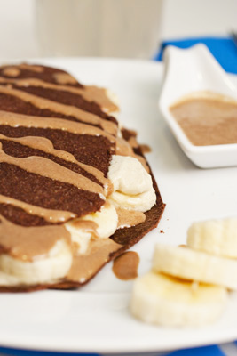

# Jasmine tea custard

*This delectable sauce is based on a recipe of the late, great chef Alain Chapel. It is especially delicious served with a slice of freshly grilled brioche, sprinkled with a veil of icing sugar.*

**Servings:** 4

## Ingredients
- 120 ml milk
- 750 ml whipping cream
- 3 tablespoons jasmine tea leaves
- 8 egg yolks
- 150 grams soft brown sugar

## Method
1. Pour 100 ml milk and 250 ml cream into a small saucepan and slowly bring to the boil. 
1. Immediately take the pan off the heat and stir in the tea leaves. 
1. Cover the pan and leave to infuse for 2 minutes.
1. Meanwhile, put the egg yolks and brown sugar into a bowl and work together lightly with a wooden spoon for about 1 minute.
1. Pour the hot infusion on to the egg mixture and mix thoroughly. 
1. Stir in the remaining cream and set aside to infuse for 30 minutes.
1. Pass the mixture through a fine-meshed conical sieve into a clean saucepan and cook very gently for about 5 minutes, stirring continuously with a wooden spoon. 
1. Pour into a bowl and stir in the remaining milk.
1. Leave to cool, stirring occasionally to prevent a skin from forming. 
1. Cover and chill until ready to serve.