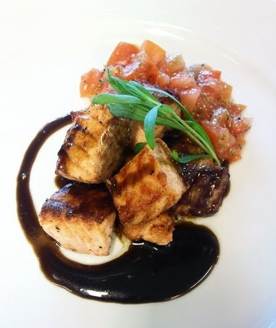

# Liquorice sauce

*This sauce has an unusual but delicious flavour, which perfectly complements a pear tart or plum clafoutis. Although this is a sweet sauce, this works perfectly well with grilled salmon.*

**Servings:** 4

## Ingredients
- 250 ml milk
- 60 grams caster sugar
- 25 grams liquorice extract
- 3 egg yolks
- 50 ml whipping cream

## Method
1. Put the milk in a saucepan with two-thirds of the sugar, add the liquorice and bring to the boil over a medium heat.
1. Meanwhile, whisk the egg yolks and the remaining sugar together in a bowl until the mixture becomes pale and has a light ribbon consistency.
1. Pour the liquorice milk on to the egg yolk and sugar mixture, whisking constantly, then pour the mixture back into the saucepan.
1. Cook over a low heat, stirring with a wooden spatula or spoon; do not let it boil or it will curdle. 
1. The sauce is ready when it has thickened enough to lightly coat the back of the spatula. 
1. When you run your finger through, it should leave a clear trace.
1. Immediately take the pan off the heat.
1. Pour the sauce through a fine-meshed conical sieve into a bowl set over crushed ice and leave to cool, stirring occasionally to prevent a skin from forming. (At this stage, the sauce can be kept covered in the fridge for up to 48 hours.)
1. Just before serving, whip the cream and fold into the sauce.