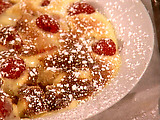

# Sabayon

*Serve the sabayon immediately - either in a glass as it is, or spoon it over a dessert such as a medley of red fruits, or fruit filled crêpes in a gratin dish and place under a hot grill until the sabayon is lightly grilled.*

**Servings:** 4

## Ingredients
- 100 ml Sauternes or other sweet white wine
- 3 egg yolks
- 40 grams caster sugar

## Method
1. Two-thirds fill a saucepan (large enough to hold a heatproof round-bottomed bowl) with warm water, and heat gently. 
1. Pour the Sauternes into the bowl, then add the egg yolks, whisking as you go. 
1. Carry on whisking as you show in the sugar.
1. Place the bowl over the saucepan, making sure that the bottom of the bowl is not in direct contact with the water. 
1. Continue whisking the mixture over the heat so that it gradually thickens, making sure that the temperature of the water in the pan increases steadily but moderately.
1. After 8 - 10 minutes, the mixture should have reached a light ribbon consistency. 
1. It is essential to keep whisking all the time. 
1. When the temperature reaches 55°C, the sabayon is cooked.
1. Turn off the heat and continue whisking until the sabayon has a very thick ribbon consistency and a fluffy, rich and shiny texture. 
1. Remove the bowl from the pan.

### Marsala sabayon
For a richer sabayon, replace the Sauternes with Marsala, or Banyuls if you prefer. This is delicious spooned over summer berries and briefly gratinéed - either under the grill or using a cook's blowtorch.

### Eau-de-vie sabayon
Replace the Sauternes with 75 ml eau-de-vie, such as raspberry or pear, or Kirsch, and add 50 ml water and an extra 20 grams sugar.