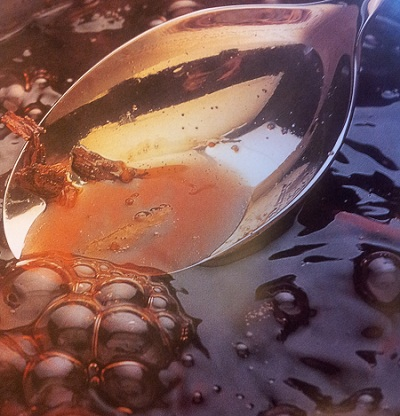

# Sweet spiced red wine sauce

*This sauce goes perfectly with peaches or pears, or to enhance the flavour of a moulded rice pudding. You can also churn the sauce to make an excellent sorbet, just stir in 75 ml water before churning.*

**Servings:** 8

## Ingredients
- 500 ml red wine (preferable Pinot Noir)
- 200 grams caster sugar
- 1 cinnamon stick (crushed)
- 1 clove
- 2 vanilla pods (split length-ways)
- finely pared zest and juice of 1 orange
- small pinch of freshly grated nutmeg
- 1 tablespoon mint leaves

## Method
1. Pour the red wine into a saucepan and add the sugar, spices, vanilla, orange zest and juices. 
1. Slowly bring to the boil and let bubble gently until the liquid has reduced by one-third.
1. Off the heat, add the nutmeg and mint and allow to infuse for a few minutes, then pass the sauce through a fine-meshed conical sieve into a bowl. 
1. Leave to cool completely, then refrigerate until ready to use.