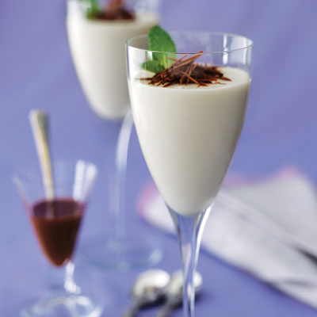

# White chocolate sauce with mint

*Mint adds a touch of freshness to this sauce, which is sublime when poured over dark chocolate ice cream*

**Servings:** 6

## Ingredients
- 250 grams best-quality white chocolate
- 100 ml milk
- 250 ml double cream
- 7 grams fresh mint leaves
- 3/4 teaspoon caraway seeds

## Method
1. Chop the white chocolate and place it in a heatproof bowl. 
1. Set over a pan of barely simmering water (making sure the bottom of the bowl is not in contact with the water) and melt it gently over a low hear, stirring with a wooden spoon occasionally until smooth.
1. Meanwhile, bring the milk and cream to the boil in a saucepan. 
1. When it begins to bubble, toss in the mint leaves and caraway seeds, turn off the heat and cover the saucepan. 
1. Leave to infuse for 10 minutes.
1. As soon as the chocolate has melted, remove the bowl from the heat. 
1. Pass the infused cream mixture through a fine-meshed sieve onto the melted chocolate, mixing with a whisk until it has fully amalgamated.
1. Transfer the chocolate sauce to a clean saucepan set over a medium heat and let bubble for a few seconds, whisking continuously.
1. Serve the sauce immediately, you can keep it warm in a bain-marie for a short while if necessary.
