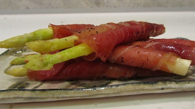

# Asparagus and prosciutto bundles

**Serves:** 4 - 6

## Ingredients
- 24 spears fresh asparagus (trimmed)
- 8 slices prosciutto (cut into thirds length-ways)
- 2 tablespoons olive oil
- 1 tablespoon balsamic vinegar
- 175 grams [hollandaise sauce](../sauces/sauce-savory/hollandaise-sauce.md) (optional)
- salt and freshly ground black pepper

## Method
1. Preheat the oven to 200°C.
1. Mix the olive oil and the balsamic vinegar together in a bowl, and season with salt and freshly ground black pepper.
1. Tip the asparagus into the bowl, and coat generously.
1. Place the asparagus on a baking tray, and pour the oil and vinegar mixture over the asparagus.
1. Place the tray in the oven, and cook for 5 minutes.
1. Once cooked, cut the spears in half and lay the bottom half of each spear next to its tip and secure together with a piece of prosciutto .
1. Serve warm with an optional hollandaise sauce dip.