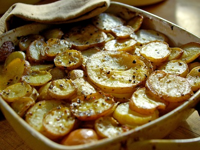

# Boulangère potatoes

*This classic French dish is simply potatoes with sliced onions and cooked in stock. It marries perfectly well with roast loin or leg of lamb.*

**Serves:** 4

## Ingredients
- 50 grams butter
- 2 onions (sliced)
- 675 grams potatoes (thinly sliced)
- salt and freshly ground white pepper
- 450 ml hot chicken stock (or vegetable stock)

## Method
1. Preheat the oven to 230°C.
1. Melt a little of the butter and fry the onions until softened.
1. Reserve some of the sliced potatoes to arrange on top of the dish, then mix the remaining potatoes with the cooked onions and season with salt and pepper.
1. Place the mixture in an oven-proof dish and cover with the reserved potato slices, overlapping them across the top.
1. Pour the hot stock over the potatoes and dot with the remaining butter.
1. Cook in the oven for 20 minutes, until the potatoes begin to colour.
1. Reduce the oven temperature to 200°C and cook for a further 40 - 45 minutes, pressing down on the potatoes with a wooden spatula occasionally.
1. By the end of the cooking, the potatoes will have absorbed the stock and should be golden and crispy on top.
1. To finish, sit the potatoes under a hot grill to achieve an extra rich golden colour.