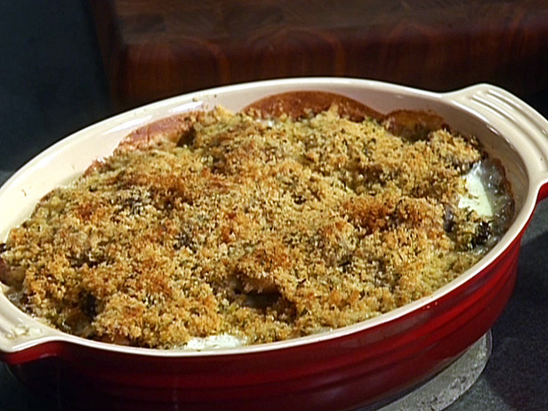

# Brussels sprouts au gratin

*This wonderfully delicious side dish complements any roast dinner. If you wish, add some cooked pancetta at the end and top with freshly grated lemon rind.*

**Serves:** 4

## Ingredients
- 480 grams Brussels sprouts
- 180 grams dried breadcrumbs
- 180 ml Extra origin olive oil
- 120 grams flat leaf parsley (finely chopped)
- 4 cloves garlic (finely chopped)
- 180 grams pecorino cheese (freshly grated)
- salt and pepper

## Method
1. Preheat the oven to 200°C. 
1. Parboil the Brussels sprouts in boiling salted water for 5 minutes, then remove and plunge in a bowl of ice cold water to refresh, drain thoroughly.
1. Drizzle 2 tablespoons of the oil in an oven-proof oval dish just big enough to hold all of the sprouts. 
1. Mix together the breadcrumbs, cheese, parsley, garlic and remaining oil in a small bowl. 
1. Season with salt and pepper. Sprinkle the mixture over the Brussels sprouts.
1. Put the dish in the middle of the oven and cook for 15 minutes. 
1. Remove from the oven, drizzle with a little olive oil and serve at once.