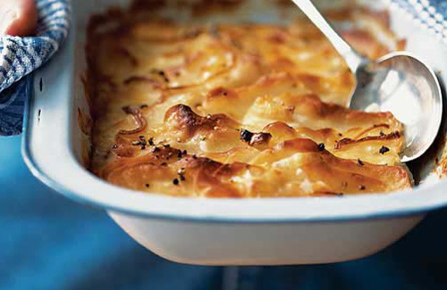

# Celeriac and potato dauphinoise

*This wonderful French potato dish includes the marriage of celeriac which balances out well, the warm flavours of this dish work well with steaks and beef dishes.*

**Serves:** 4

## Ingredients
- 2 large onions (sliced)
- 50 grams butter
- 600 ml double cream
- 1 garlic clove (crushed)
- salt and freshly ground black pepper
- 450 grams potatoes (thinly sliced)
- 1 large celeriac (peeled and thinly sliced)

## Method
1. Preheat the oven to 180 - 190°C.
1. Cook the onions in half of the butter for 2 - 3 minutes, so they soften but do not colour, then set aside to cool.
1. Bring the cream to the boil in a pan, along with the crushed garlic and remaining butter. Season with salt and plenty of pepper.
1. Arrange the onions, potatoes and celeriac in a large oven-proof dish, making sure that the potatoes surround the celeriac .
1. Overlap the top layers of potatoes to give a neater finish.
1. Pour over the cream, making sure that the potatoes are completely covered.
1. Bake in the oven for 45 - 60 minutes until the vegetables are tender and have absorbed most of the cream.
1. Cover the potatoes with foil if they are browning too quickly.
1. Once cooked, if necessary, heat under a hot grill to give a golden colour.