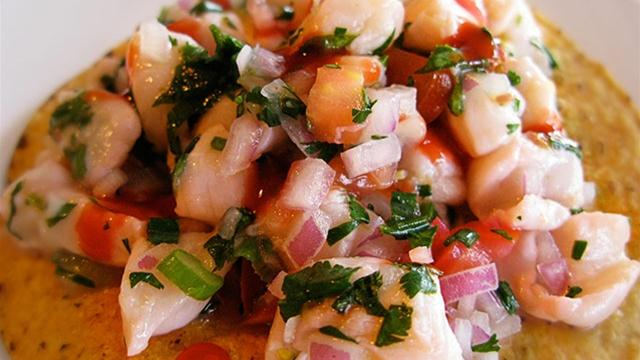

# Ceviche

*Fresh fish is "cooked" by being marinated in a mixture of mango, lime juice and chillies. The result is an appetizer with a wonderful fresh flavour.*

*Make the fish and seafood used for this dish is as fresh as possible.*

**Serves:** 6

## Ingredients
- 350 grams medium cooked prawns (peeled and de-veined)
- 350 grams scallops (removed from their shells)
- 350 grams salmon fillet
- 2 tomatoes
- 1 red onion (finely chopped)
- 1 small mango
- 1 fresh red chilli (de-seeded and chopped)
- 12 limes
- 2 tablespoon caster sugar
- 2 pink grapefruit
- 3 oranges
- salt and freshly ground black pepper

## Method
1. Cut the scallop into 1 cm dice, and add them to a bowl with the prawns.
1. Dice the tomatoes.
1. Peel the mango and cut off a thick slice close to the flat side of the stone, repeat on the other side.
1. Score the flesh with criss-cross lines, then fold the slices inside out so the dice stand proud of the skin.
1. Slice the mango flesh off the skin and into a bowl.
1. Skin the salmon if necessary, then cut into small pieces.
1. Add the salmon, chilli, tomatoes, onion and shellfish to the bowl with the mango.
1. Squeeze the juice of 8 of the limes into the bowl with the sugar and seasoning, stir and cover.
1. Leave to marinate in the refrigerator for 3 hours.
1. Segment the grapefruit, orange and remaining limes.
1. Drain off as much excess lime juice as possible from the marinated fish and gently fold in the fruit segments.
1. Season to taste and arrange on a platter.