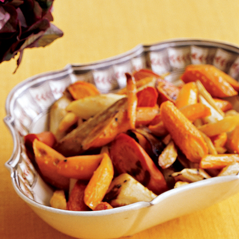

# Chanternay carrots and parsnips with maple syrup and a mustard glaze

*This wonderfully sweet glazed carrot and parsnip side dish compliments any hearty roast dinner with an air of elegance.*

**Serves:** 6

## Ingredients
- 300 grams Chanternay carrots (halved)
- 300 grams parsnips (peeled and cut into batons)
- 2 tablespoons olive oil
- 3 tablespoons maple syrup
- 1 tablespoon whole grain mustard
- zest and juice of half an orange

## Method
1. Preheat the oven to 200°c
1. Place the carrots and parsnips in a large roasting tin in a single layer. 
1. Drizzle with olive oil and season. 
1. Roast in the oven, turning occasionally for 30 minutes.
1. Mix the maple syrup, mustard and orange juice with zest in a jug and pour over the semi-roasted vegetables. 
1. Return to the oven and roast for a further 10-15 minutes until caramelised and sticky.