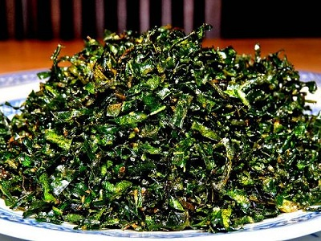

# Crispy cabbage

*This recipe dispels the myth that cabbage is tasteless and soggy, the crisp saltiness of the cabbage marries well with anything from a roast dinner to a Chinese dish.*

*It is important that when frying the cabbage to place a lid on the pan, as the high water content in the cabbage will cause the oil to spit.*

**Serves:** 4 - 6

## Ingredients
- half a savoy cabbage
- oil (for deep frying)
- salt

## Method
1. Cut the cabbage into three wedges, removing the core.
1. It it important to use the outside leaves, as well as the inner leaves for a good contrast in colours from light to deep green.
1. Heat the oil to 180°C.
1. Add the cabbage to the pan, and immediately place the lid on the pan to stop the oil from spitting.
1. Once the 'crackling' sound has stopped, the cabbage should be ready with just a little colouring around the edges.
1. Drain off all the excess fat on kitchen paper, and lightly salt.
1. Serve at once.