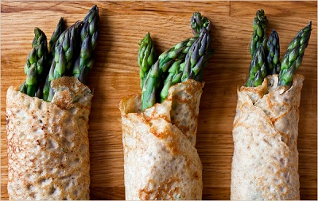

# Herb crêpes

*These crêpes work really well when sandwiched between meat and pastry, as it forms a protective layer beneath the pastry to help keep it dry and crisp.*

**Servings:** 6

## Ingredients
- 60 grams plain flour
- 150 ml milk
- 2 eggs
- salt and fresh ground pepper
- 15 grams chopped herbs (parsley, chervil, chives)
- 30 grams clarified butter

## Method
## Making the batter
1. Put the flour into a bowl and make a well.
1. Add on-third of the milk, the eggs, a pinch of salt and a turn of the pepper mill.
1. Mix lightly with a whisk to make a smooth batter, then pour in the rest of the milk and mix thoroughly.
1. Pass the batter through a chinois or fine-meshed conical sieve.
1. Cover with cling film and leave to rest for at least 30 minutes.
1. Stir the herbs into the batter just before cooking the crêpes.

## Cooking the crêpes
1. Lightly grease a 26 - 30 cm frying pan with a touch of clarified butter.
1. Give the batter a stir, then ladle in just enough to cover the base of the pan.
1. Cook quickly for about 1 minute, then turn the crêpe over with a palette knife and cook for barely a minute.
1. Repeat until you have used all the batter
1. Stack the cooked crêpes on a plate, layering a piece of greaseproof paper between each one to prevent them from sticking together.