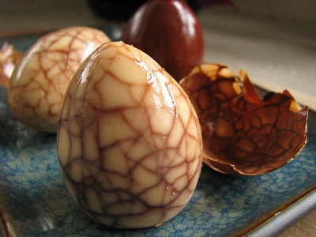

# Marbled tea eggs

*This unique method of cooking eggs in spiced tea derives its name from the marbled texture and web of cracks which appear on the surface of eggs when they are shelled.*

*Traditionally, tea eggs are served cold and make a wonderful and easy garnish for cold platters. Once the eggs have cooled, they can be kept in the tea liquid in the refrigerator for up to 2 days.*

**Servings:** 4 - 6

## Ingredients
-  6 eggs (at room temperature)
- 1.7 litres water

### Tea mixture
- 3 tablespoons black Chinese tea
- 2 tablespoons dark soy sauce
- 1 teaspoon salt
- 1 cinnamon stick
- 1 star anise

## Method
1. Fill a large pot with the water and bring to the boil.
1. Using a large slotted spoon, lower the eggs into the pot and lower the water to a gentle simmer.
1. Cook the eggs for 10 minutes, then remove them and place in a bowl of cold water (Do not discard the cooking water).
1. After 10 minutes, when the eggs have cooled, gently crack each shell with the back of a spoon until the entire shell is a network of cracks.
1. Take the pot of water in which the eggs have been cooked and combine it with the tea mixture.
1. Bring the mixture to a boil and return the cracked eggs to the pot.
1. Reduce the heat to a simmer and cook the eggs for about 25 minutes.
1. Remove the pot from the heat and allow the eggs to cool in the liquid.
1. Remove the eggs from the cooled liquid and gently peel off the cracked shells.
1. You should have a beautiful marble-like web on each egg.
1. Serve them cut in half or quarters as a snack with other cold dishes or use them as a garnish.