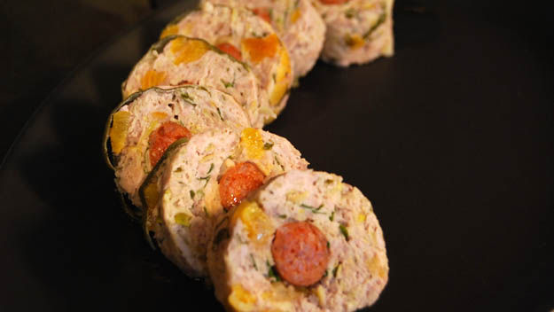

# Pork, apricot and pistachio stuffing

*This delightful warm stuffing goes particularly well with roasted game such as chicken, poussin or turkey. This recipe includes stuffing for the bird, plus 20 individual stuffing balls.*

**Servings:** 

## Ingredients
- 50 grams butter
- 1 large onion, finely chopped
- small bunch of flat leaf parsley
- small bunch of sage leaves, chopped
- 900 grams pork sausage meat
- 75 grams fresh white bread crumbs
- 1 large egg
- 100 grams dried apricots, chopped
- 75 grams shelled pistachios, chopped
- olive oil to drizzle
- 2 chorizo sausages

## Method
1. Melt the butter in a large frying pan over a low heat.
1. Add the onion and cook for 5 minutes until softened, but not coloured.
1. Season well and remove from the heat, set aside to cool completely.
1. Transfer the onion to a large bowl.
1. Add the parsley, sage, sausage meat, breadcrumbs, egg, apricots and pistachios.
1. Stir to combine.
1. Season well.
1. Use a quarter of the mix to stuff the bird.
1. Cut the chorizo into 1 cm slices and fry for about 2 minutes on each side.
1. Roll the remaining stuffing into about 20 walnut sized balls around each slice of chorizo.