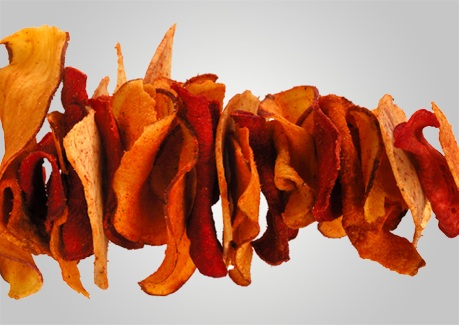

# Potato and parsnip crisps

*The potato and parsnips crisps are wonderful as pre-dinner snacks or as a garnish for a main meal. They are simple to make and taste amazing.*

**Serves:** 4

## Ingredients
- 2 large potatoes (peeled)
- 3 large parsnips (peeled)
- 1 litre oil (for frying)
- salt

## Method
1. Using a vegetable peeler or mandolin, slice the potatoes very, very thinly.
1. Using a vegetable peeler or mandolin, slice the parsnips length-ways very, very thinly.
1. Dry the slices on a piece of kitchen roll.
1. Pre-heat a deep fat frying pan to 180°C.
1. Fry the potato crisps and parsnips a handful at a time until crisp and golden all the way through.
1. Remove from the oil, and shake off any excess oil.
1. Sprinkle over salt, and serve.