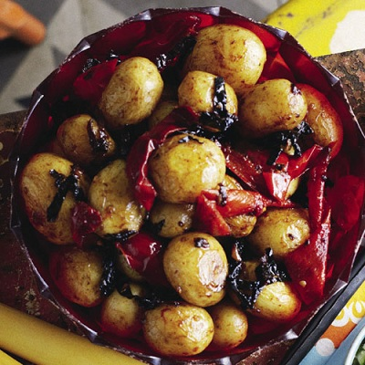

# Potatoes with red chillies

*If you like chillies, you'll love these potatoes! The red chillies add colour, flavour and fire to the finished dish, which is fragranced with warming spices.*

**Serves:** 4

## Ingredients
- 12 small new potatoes (halved)
- 2 tablespoons vegetable oil
- ½ teaspoon crush ed dried chillies
- ½ teaspoon white cumin seeds
- ½ teaspoon fennel seeds
- ½ teaspoon crushed coriander seeds
- 1 teaspoon salt
- 1 onion (sliced)
- 2 fresh red chillies (chopped)
- 3 tablespoons coriander (freshly chopped)

## Method
1. Bring a pan of lightly salted water to the boil and cook the potatoes for about 15 minutes until tender, but still firm.
1. Remove from the heat and drain off the water, and set aside until needed.
1. Heat the oil in a deep frying pan and add the crushed chillies, cumin, fennel and coriander seeds.
1. Sprinkle the salt over and fry, stirring continuously for 30 - 40 seconds.
1. Add the sliced onion and fry until golden brown.
1. Tip in the dry potatoes and add the chopped red chillies and 1 tablespoon of the chopped coriander and stir well.
1. Reduce the heat to very low, then cover and cook for 5 - 7 minutes.
1. Serve the potatoes hot, on a heated dish, garnished with the remaining chopped fresh coriander.