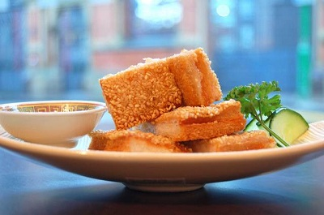

# Prawn toast

*Sesame prawn toast is a savoury snack which is often served in dim sum restaurants outside China.*

**Servings:** 30

## Ingredients
- 10 thin slices of bread
- 3 tablespoons white sesame seeds
- 400 ml oil for deep frying

### Prawn paste
- 450 grams uncooked peeled prawns
- 1 teaspoon salt
- 1 egg
- 2 tablespoons spring onions (finely chopped)
- 2 teaspoons fresh ginger (finely chopped)
- 1 tablespoon light soy sauce
- 1 teaspoon sesame oil

## Method
### To make the paste
1. Using a cleaver or sharp knife, chop the prawns coarsely and then mince finely into a paste.
1. Put the paste in a bowl and mix in the rest of the ingredients.

### To make the toast
1. If the bread is fresh, place it in a warm oven to dry out (Dry bread absorbs less oil).
1. Remove the crusts and cut the bread into rectangles about 7 cm x 3 cm.
1. Spread the prawn paste on each piece of bread, about 3 mm thick.
1. Sprinkle the toasts with the sesame seeds.

### To cook the toast
1. Heat the oil in a deep fat fryer or wok to a moderate heat.
1. Deep fry several prawn toasts at a time, paste side down for 2 - 3 minutes.
1. Turn them over and deep fry for about 2 minutes or until they are golden brown.
1. Remove with a slotted spoon and drain on kitchen paper.
1. Repeat with the remaining toasts.