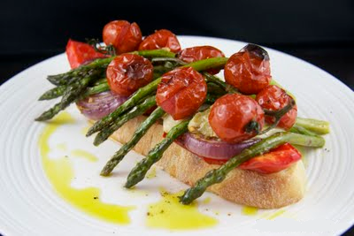

# Roasted vegetable stacks

**Prep Time:** 20 minutes
**Cooking Time:** 30 minutes
**Serves:**  4

## Ingredients
- 3 red peppers (quartered, cored and pith removed)
- 3 yellow peppers (quartered, cored and pith removed)
- 2 red onions (peeled and halved lengthwise)
- 4 baby artichoke hearts in oil (drained and halved)
- 2 plum of beefsteak tomatoes (halved)
- 12-16 asparagus stalks
- 8 tablespoons garlic vinaigrette
- 15 cm chunk French bread (quartered)
- 1 large garlic clove (unpeeled and cut in half )

## Method
1. Heat the oven to 220°C.
1. Place the peppers, onions, artichokes and tomatoes, cut sides up, in a roasting tin, then add the asparagus. 
1. The vegetables should be in one layer, not stacked on each other. 
1. Drizzle over half the vinaigrette and roast for 30 minutes, removing the asparagus halfway through cooking.
1. Heat a ridged griddle pan until very hot. Rub the bread with the garlic clove, then cook on both sides until toasted and griddle marked. 
1. Place a slice of bread on each plate and stack the roasted vegetables on top in this order: red peppers, yellow peppers, onions, artichokes, a criss-cross of asparagus, and a tomato in half. 
1. Use a skewer to secure them, if necessary.
1. Drizzle with the remaining vinaigrette, season and serve warm.