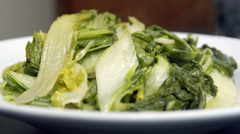

# Spiced Chinese leaves

*Unlike the more familiar green and red cabbage, Chinese leaves have a bland, sweet flavour which is delicate, rather like lettuce. Cooking is needed to make it palatable, and because it is so light, it calls for a robust sauce.
*

**Serves:**  2 - 4

## Ingredients
- 700 grams Chinese leaves (or white cabbage)
- 1 tablespoon oil
- 2 teaspoons fresh ginger (finely chopped)
- 2 teaspoons garlic (finely chopped)
- 1 dried red chilli
- 1 tablespoons fry sherry or rice wine
- 2 tablespoons dark soy sauce
- 2 teaspoons sugar
- 50 ml water
- 2 teaspoons sesame oil

## Method
1. Separate and wash the leaves well, and cut them into 2 cm wide strips.
1. Heat a large wok or frying pan, and when it is hot, add the oil.
1. A few seconds later add the ginger and stir-fry it quickly.
1. Add the garlic and dried chilli and toss them well for a few seconds.
1. Add the sherry or rice wine, soy sauce, sugar and water.
1. Bring the mixture to a simmer and then add the leaves.
1. Boil over a high heat for 5 minutes until it is thoroughly cooked, stirring occasionally.
1. Just before serving, add the sesame oil, and stir well.