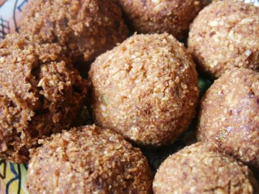

# Spicy peanut balls

*Tasty rice balls, rolled in chopped peanuts and deep-fried, make a delicious snack. Serve them as they are or with a chilli sauce for dipping.*

**Yield:** 16

## Ingredients
- 1 garlic clove (crushed)
- 1 cm piece root ginger (peeled and finely chopped)
- 1 red chilli (de-seeded and chopped)
- ¼ teaspoon ground tumeric
- 1 teaspoon sugar
- ½ teaspoon salt
- 1 teaspoon chilli sauce
- 2 teaspoons soy sauce
- 2 tablespoon coriander (freshly chopped)
- juice of half a lime
- 225 grams cooked white long grain rice
- 115 grams peanuts (chopped)
- oil (for frying)

## Method
1. Put the crushed garlic, ginger and chilli in a food processor.
1. Add the tumeric and process to a paste.
1. Add the sugar, salt, chilli sauce, soy sauce, coriander and lime juice.
1. Process briefly to mix.
1. Add three-quarters of the cooked rice to the paste in the food processor, and process until smooth and sticky.
1. Scrape into a mixing bowl and stir in the remainder of the rice.
1. Wet your hand and shape the mixture into small balls.
1. Roll the balls, a few at a time in the chopped peanuts, making sure they are evenly coated.
1. Chill the balls in the fridge for 30 minutes.
1. Heat the oil for deep-frying to 180°C, or until a cube of day old bread brows in about 45 seconds.
1. Deep fry the peanut balls until crisp.
1. Drain on kitchen paper, then pile on to a platter.