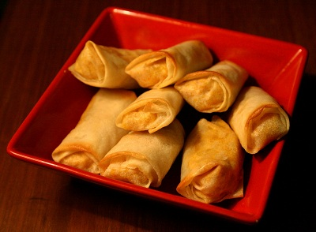

# Spring rolls

*Spring rolls are among the best known Chinese snacks. They are not difficult to make and are a perfect starter for any meal.*

**Servings:** 12

## Ingredients
- 1 packet spring roll skins
- 175 grams Parma ham
- 110 grams mange tout (trimmed)
- 110 grams red pepper (de-seeded)
- 110 grams waterchestnuts (drained)
- 1 tablespoon groundnut oil
- 110 grams fresh bean sprouts
- 4 spring onions (finely shredded)
- 1 teaspoon salt
- 1 teaspoon sugar
- 1 teaspoon light soy sauce
- 1 teaspoon dark soy sauce
- 1 teaspoon sesame oil
- 1½ tablespoons dry sherry or rice wine
- 1 litre oil (for deep frying)
- 3 tablespoons plain flour (blended with 1½ tablespoons water)

## Method
### To prepare the filling
1. Finely shred the Parma ham, mange tout and pepper into very thin slices using a very sharp knife.
1. Rinse the waterchestnuts in cold water, drain and slice very finely.
1. Heat a wok or large frying pan, add the 1 tablespoon of groundnut oil when the wok is very hot.
1. Stir fry the Parma ham and vegetables for 1 minute.
1. Add the salt, sugar, soy sauces, sesame oil and sherry or rice wine.
1. Stir fry for 3 minutes and tip into a chinois or fine-meshed conical sieve to drain and cool.

### To make the pancakes
1. Mix the flour paste in a small bowl.
1. Put about 3 tablespoons of the cooled filling on each spring roll skin.
1. Fold in each side and then roll it up tightly.
1. Use the flour paste to seal the open end by brushing a small amount on the edge.
1. Press the edge onto the roll to seal.

### To cook the pancakes
1. Heat the 1 litre of oil in a deep fat fryer or large wok until it is hot and almost smoking.
1. Deep fry the spring rolls in several batches until they are golden brown.
1. Drain on kitchen paper and serve at once.