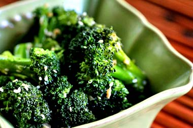

# Stir-fried ginger broccoli

*This dish is best suited to sprouting broccoli, which has a lovely purple hue. This dish can be served at room temperature in the summer as a wonderful salad accompaniment. 
*

**Serves:**  2 - 4

## Ingredients
- 450 grams fresh broccoli
    1 tablespoon oil
 2.5 cm pieces of fresh ginger (finely shredded)
  ½ teaspoon salt
  ½ teaspoon sesame oil

## Method
1. Separate the broccoli heads into small florets, and peel and slice the stems.
1. Blanch the broccoli pieces in a large pot of boiling salted water for several minutes, then plunge into ice cold water and drain thoroughly.
1. Heat the oil in a large wok or frying-pan.
1. When it is moderately hot, add the ginger shreds and salt.
1. Stir-fry for a few seconds, and then add the blanched broccoli (If it seems dry, add a few tablespoons of water).
1. Stir-fry at a moderate to high heat for 4 minutes until the broccoli is thoroughly heated through.
1. Add the sesame oil and continue to stir-fry for 30 seconds.
