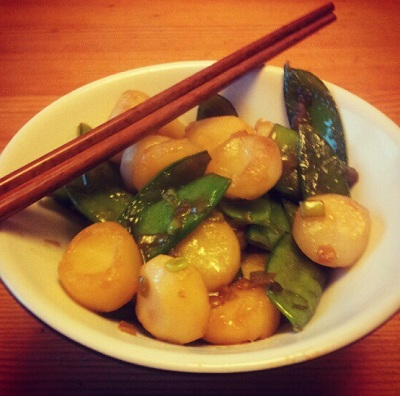

# Stir fried mange tout with waterchestnuts

*This sweet crunchy side dish is a perfect accompaniment to any Chinese dish, but works especially well with lemon chicken.*

**Servings:** 2 - 4

## Ingredients
- 225 grams waterchestnuts (drained)
- 1 tablespoon groundnut oil
- 3 tablespoons spring onions (finely chopped)
- 225 grams mange tout (trimmed)
- 1 tablespoon light soy sauce
- 2 tablespoons water
- ½ teaspoon salt
- ½ teaspoon sugar
- 1 teaspoon sesame oil

## Method
1. Drain,rinse and thinly slice the waterchestnuts.
1. Heat a wok or large frying pan over a medium heat.
1. Add the oil, and when it is hot, add the spring onions.
1. A few seconds later, add the mange tout and stir fry them. If you are using fresh waterchestnuts, add these now.
1. Stir fry for 1 minute, making sure everything is coated thoroughly in oil.
1. Add the soy sauce, water, salt, sugar and sesame oil.
1. Stir fry for a further 3 minutes.
1. If you are using tinned waterchestnuts, add these and cook for a further 2 minutes.
1. Serve immediately.