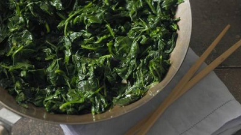

# Stir fried spinach with garlic

*Spinach has often been regarded with disdain in the West, probably because it is often overcooked. This is a time-honoured, delicious southern Chinese recipe. The spinach is quickly stir-fried and then seasoned. It is very simple to prepare and tastes divine.*

**Serves:**  4

## Ingredients
- 700 grams fresh spinach
- 1 tablespoon oil
- ½ teaspoon salt
- 1 teaspoon sugar
- 2 teaspoons garlic (finely chopped)

## Method
1. Wash the spinach thoroughly, removing all the steams and leaving just the leaves.
1. Heat a large wok or pan to a moderate heat and add the oil, salt and spinach.
1. Stir-fry for 2 minutes to coat the spinach thoroughly with the oil and salt.
1. When the spinach has wilted to about one-third of its original size, add the sugar and garlic and continue to stir-fry for another 4 minutes.
1. Transfer the spinach to a plate and pour off any excess liquid.