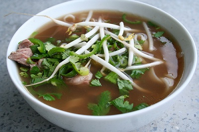

# Beef pho

*This dish works best with raw beef that has been sliced paper thin, as it cooks in seconds when placed in the hot broth. *

**Serves:** 4

## Ingredients
- 200 grams rice noodles
- 1.5 litres beef stock
- 1 star anise
- 4 cm fresh ginger (sliced)
- 2 pigs trotters
- half an onion studded with 2 cloves
- 2 lemon grass stems (pounded)
- 2 garlic cloves (crushed) 
- ¼ teaspoons white pepper
- 1 tablespoon fish sauce sauce
- 400 grams beef fillet (frozen)
- 90 gram bean sprouts (trimmed)
- 2 spring onions (thinly sliced on the diagonal)
- 25 grams coriander leaves (chopped)
- 25 grams mint (chopped)
- 2 fresh red chillies (thinly sliced)
- mint leaves(extra to serve)
- coriander leaves(extra to serve)
- 2 limes (quartered)
- fish sauce (to serve)

## Method
1. Slice the frozen beef as thinly as possible. If the beef begins to thaw, put it back in the freezer for 15 minutes.
1. Soak the noodles in boiling water for 15 - 20 minutes. Drain.
1. Bring the stock, star anise, ginger, trotters, onion, lemon grass, garlic and white pepper to the boil in a large saucepan.
1. Reduce the heat and simmer for 30 minutes.
1. Strain, return to the same pan and stir in the fish sauce.
1. Divide the noodles among bowls, then top with beef strips, been sprouts, spring onion, coriander, mint and half of the chillies.
1. Ladle over the broth.
1. Put the remaining chillies, mint, coriander, lime quarters and fish sauce in small bowls on a platter and serve with the soup.