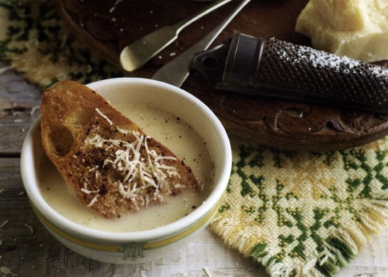

# Beef and wine soup

*Eisacktaler Weinsuppe*

*From Eisacktaler in the Italian Valle d'Isarco - the extreme eastern part of the Alps - comes this heart-warming and delightful soup. There as as many people speak German as they do Italian, thus the name 'wine soup', a good example of the influence neighbouring countries have on the Italian regions and their food.*

**Serves:** 4

## Ingredients
- 1 litre strong beef stock or broth
- 500 ml white wine
- 4 slices country bread
- 40 grams unsalted butter
- ½ teaspoon ground cinnamon
- 100 ml double cream
- 100 grams freshly grated Parmesan
- Freshly grated Parmesan - to serve

## Method
1. Put the stock and the wine together in a large saucepan and bring to the boil.
1. Cook for 1 minute only.
1. Remove from the heat and set aside.
1. Fry the bread in the butter on both sides until golden.
1. Sprinkle the cinnamon over each slice of bread.
1. Put one slice of bread in each soup bowl.
1. Add the cream to the soup and heat gently to warm through.
1. Stir the Parmesan into the soup.
1. Pour the soup over the bread and sprinkle with a little more Parmesan.