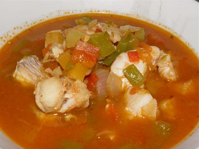

# Caribbean fish soup

**Serves:** 6

## Ingredients
- 2 tomatoes
- 2 tablespoons oil
- 4 shallots (finely chopped)
- 2 celery stalks (chopped)
- 1 large red pepper
- 1 scotch bonnet chilli (de-seeded and finely chopped)
- ½ teaspoon ground allspice
- ½ teaspoon nutmeg (freshly grated)
- 875 ml fish stock
- 275 grams sweet potato (peeled and cut into cubes)
- 3 tablespoons lime juice
- 500 grams cod (skinless)

## Method
1. Rub the pepper skin with oil, and grill skin-side up under a hot grill for 5 - 6 minutes, or until the skin blackens and blisters.
1. Seal the peppers in a plastic bag to sweat. Once cooled, remove the skin from the peppers with your fingers.
1. Chop the pepper into medium dice.
1. Score a cross in the base of each tomato.
1. Soak in boiling water for 30 seconds,  and plunge into ice cold water.
1. Drain and peel the skin away from the cross.
1. Chop the tomatoes, discarding the core and reserving the juices.
1. Heat the oil in a large saucepan, then add the shallots, celery, red pepper, chilli, allspice and nutmeg.
1. Cook for 4 - 5 minutes, or until the vegetables have softened, stirring occasionally.
1. Add the chopped tomatoes and the reserved juices, along with the stock and bring to the boil.
1. Immediately reduce the heat to medium and add the cubes of sweet potato.
1. Season to taste and cook for about 15 minutes, or until the sweet potato is tender.
1. Add the lime juice and chunks of fish to the saucepan and poach gently for 4 - 5 minutes, or until the fish is cooked through and the skin is white. 
1. Season to taste and serve immediately.