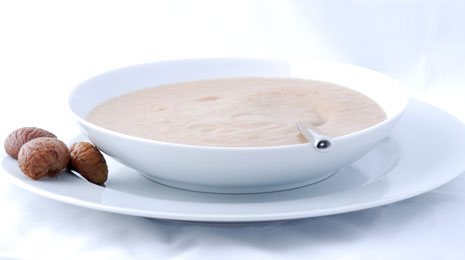

# Chestnut and Chorizo Soup

*Sopa de Castañas*

*This recipe is based on the classic flavours of the mountainous regions of Spain where sweet chestnuts thrive, producing a warm and comforting autumnal soup.*

**Serves:** 4

## Ingredients
- 4 tablespoons of olive oil
- 1 large onion
- 1 medium carrot
- 1 celery stalk
- 120 grams chorizo
- 2 garlic gloves
- 1 teaspoon ground cumin
- 2 teaspoons fresh thyme leaves
- 2 small dried red chillies
- 2 tomatoes
- 500 grams cooked chestnuts (peeled)
- 20 saffron strands
- 1 litre of water
- Salt and pepper to taste

## Method
### Preparation
1. Finely dice the onion, carrot and celery stalk.
1. Cut the chorizo into 1 cm cubes.
1. Thinly slice the garlic.
1. Finely chop the thyme leaves.
1. Crush the garlic.
1. Roughly chop the tomatoes.
1. Add the saffron strands to 4 tablespoons of boiling water.

### Fry the vegetables
1. In a large saucepan, heat the oil over a low to medium heat.
1. Add the onion, carrot, celery and chorizo with a pinch of salt.
1. Fry the vegetables, stirring occasionally for about 20 minutes until everything caramelises.

### Making the soup
1. Add the garlic, cumin, thyme and chilli and cook for a further minute.
1. Add the tomato and cook for a further 2 minutes.
1. Add the chestnuts, and stir everything together.
1. Add the saffron infused liquid along with the water.
1. Simmer for about 10 minutes.
1. Remove from the heat and allow to cool for 5 minutes.

### Bringing the soup to the table.
1. Using a potato masher, mash the soup until it is smooth with a little texture.
1. Season with salt and pepper.
