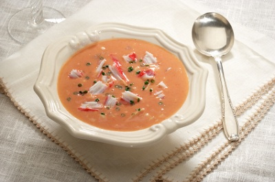

# Crab bisque

**Serves:** 4

## Ingredients
- 50 grams butter
- half a carrot (finely chopped)
- half an onion (finely chopped)
- 1 celery stalk (finely chopped)
- 1 bay leaf
- 2 thyme sprigs
- 1 kg live crabs (cleaned and claws detached)
- 2 tablespoons tomato purée
- 2 tablespoons brandy
- 150 ml dry white wine
- 1 litre fish stock
- 60 grams rice
- 3 tablespoons double cream
- ¼ teaspoon cayenne pepper

## Method
1. Heat the butter in a large saucepan.
1. Add the vegetables, bay leaf and thyme and cook over a medium heat for 3 minutes, making sure that the vegetables do not colour.
1. Add the crab claws, legs and bodies and cook for 5 minutes, or until the crab shells turn red.
1. Add the tomato paste, brandy and white wine and simmer for 2 minutes, or until reduced by half.
1. Add the stock along with 500 ml of water and bring to the boil.
1. As soon as the liquid boils, reduce the heat and simmer gently for 5 minutes.
1. Remove the crab shells, leaving the crab meat in the stock, and reserve the claws to use as a garnish.
1. Finely crush the shells in a mortar and pestle.
1. Return the crushed shells to the soup with the rice.
1. Bring to the boil, and immediately reduce to a simmer again and cook for 20 minutes, or until soft.
1. Immediately strain the bisque into a clean saucepan through a fine sieve lined with damp muslin, pressing down to extract as much liquid as possible.
1. Add the cream and season with salt and cayenne pepper, then gently reheat.
1. Serve at once, garnished with the crab claws.