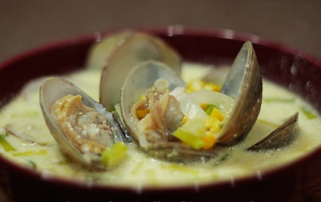

# Creamy clam soup

**Serves:** 4

## Ingredients
- 1.75 kg clams
- 50 grams butter
- 1 onion (chopped)
- 1 large carrot (chopped)
- 1 large leek (sliced)
- 250 grams swede (diced)
- 800 ml fish stock
- 1 bay leaf
- 75 grams medium or short grained rice
- 200 ml whipping cream
- 3 tablespoons flat leaf parsley (chopped)

## Method
1. Wash the clams thoroughly, discarding any that have broken shells or fail to close when you tap them.
1. Put the clams and 250 ml water in a large saucepan.
1. Bring the the boil, then immediately reduce the heat to medium and cover with a tight fitting lid.
1. Cook for 3 - 4 minutes, or until the shells open.
1. Strain into a bowl.
1. Add enough stock to make up to 1 litre.
1. Discard any clams that have failed to open.
1. Remove ball but eight of the clams from their shells.
1. Melt the butter in a saucepan.
1. Add the vegetables and cook, covered, over a medium heat for 10 minutes, stirring occasionally.
1. Add the stock and the bay leaf, and bring to the boil.
1. Immediately reduce the heat to low and simmer for 10 minutes. 
1. Add the rice, and bring back to the boil, cover and cook over a medium heat for 15 minutes, or until the rice and vegetables are tender.
1. Remove from the heat and stir in the clam meat.
1. Remove the bay leaf and allow to cool for 10 minutes.
1. Pour the soup in a blender and purée until smooth.
1. Return the soup to the pan, and stir in the cream.
1. Taste for seasoning.
1. Gently reheat the soup. 
1. Add the parsley and two of the clams in their shells to each bowl.