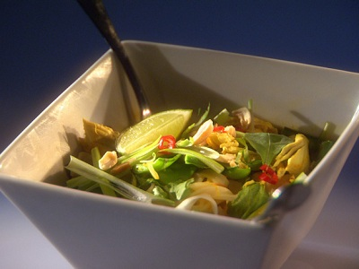

# Curried chicken noodle soup

**Serves:** 4

## Ingredients
- 175 grams thin egg noodles
- 2 tablespoons peanut oil
- 2 boneless, skinless chicken breast
- 1 onion (sliced)
- 1 small fresh red chilli (de-seeded and finely chopped)
- 1 tablespoon fresh ginger (finely chopped)
- 2 tablespoons curry powder
- 750 ml chicken stock
- 800 ml coconut milk
- 300 grams pak choy (cut into long strips)
- 20 grams basil (torn)

## Method
1. Cook the noodles in a large pan of salted boiling water for 3 - 4 minutes, or until soft. Drain well and set aside.
1. Heat the oil in a saucepan and add the chicken. Cook on each side for 5 minutes, or until cooked through. Remove the chicken and keep warm.
1. Put the onion in the pan and cook over a low heat for 8 minutes, stirring occasionally until softened but not browned.
1. Add the chilli and curry powder and cook for a further 2 minutes.
1. Add the chicken stock and bring to the boil.
1. Reduce the heat and simmer for 20 minutes.
1. Thinly slice the chicken diagonally.
1. Add the coconut milk to the saucepan and simmer for 10 minutes.
1. Add the pak choy and cook for 3 minutes, then stir in the basil.
1. To serve, divide the noodles among four deep serving bowls. Add slices of chicken and ladle in the soup.
1. Serve immediately.