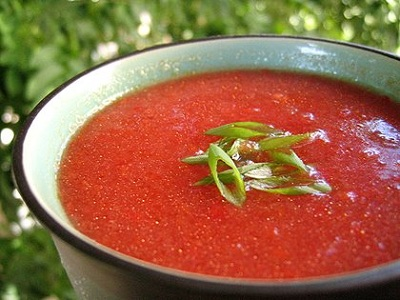

# NaGazpachome

*This wonderful chilled soup originated in Andalucía, Spain. A perfect dish for the hot summer months due to its refreshing qualities and cold serving temperature.*

**Serves:** 4

## Ingredients
- 1 kg vine-ripened tomatoes (chopped)
- 1 cucumber (chopped)
- 1 small red pepper (de-seeded and chopped)
- 1 red onion (chopped)
- 3 garlic cloves
- 80 grams sourdough bread (crusts removed)
- 2 tablespoon sherry vinegar
- a few drops of Tabasco sauce

### Dressing
- 2 teaspoons tomato (de-seeded and finely diced)
- 2 teaspoons red pepper (de-seeded and finely diced)
- 2 teaspoons cucumber (de-seeded and finely diced)
- 2 teaspoons onion (finely diced)
- 1 tablespoon extra virgin olive oil
- 1 teaspoon lemon juice

## Method
1. Combine the gazpacho ingredients into a blender with 250 ml cold water and blend until smooth. Pass through a fine-meshed conical sieve into a bowl and season to taste. 
1. Cover with cling-film and refrigerate overnight to allow the flavours to develop.
1. Combine all the dressing ingredients together in a bowl, season to taste.
1. Stir the Gazpacho well and decanter into 4 bowls.
1. Spoon the dressing in the centre of each bowl of Gazpacho before serving.