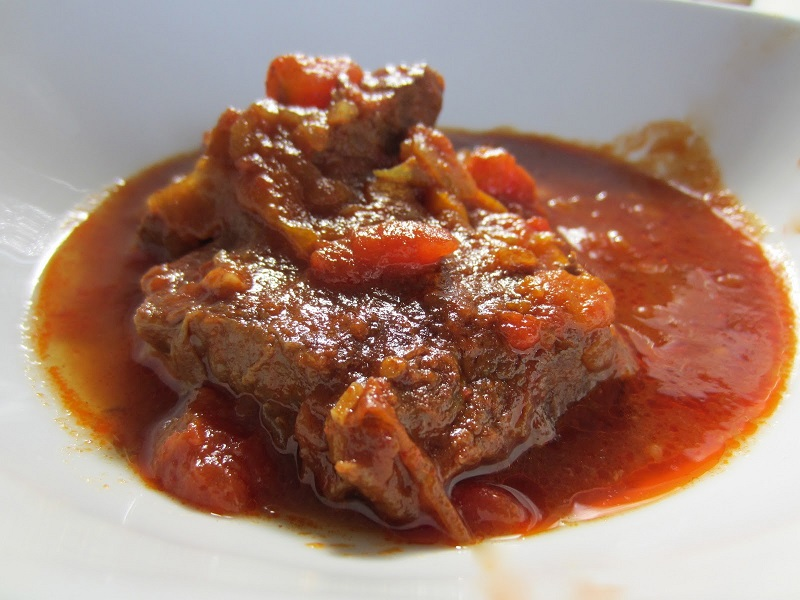

# Hungarian Goulash

*gulyás*

*Goulash is a soup or stew of meat and vegetables, seasoned with paprika. It originates from 9th Century Hungary, and the name means Herdsman.*

**Serves:** 4

## Ingredients
- 700 grams beef chuck steak
- 5 onions
- 2 tablespoons of olive oil
- 2 heaped tablespoons sweet Hungarian paprika
- ½ teaspoon whole caraway seeds
- 250 grams tomatoes
- 750 ml beef stock
- 3 large potatoes
- Fresh flat leaf parsley

## Method
## Preparation
1. Cut the steak into 1 inch cubes.
1. Peel, and finely dice the onions.
1. Score a cross in the top of each tomato, and plunge into boiling water until the skin peels away at the cross.
1. Plunge the tomatoes in ice cold water.
1. Peel each tomato, and roughly chop.
1. Peel the potatoes and chop into large dice.
1. Chop the parsley.

### Making the soup
1. Heat the oil in a large heavy cast-iron skillet.
1. Sear the steal in small batches and set aside.
1. Sauté the diced onions until they begin to colour.
1. Lower the heat, and cover to let them sweat until soft (about 5 minutes).
1. Add the paprika, caraway, tomato and seared beef.
1. Stir the contents together and add the beef stock.
1. Cover and let the soup simmer for at least an hour.
1. Add the potatoes and allow to cook for 30 minutes.
1. Season with salt and pepper.

### Bringing the soup to the table.
1. Serve, topped with a sprinkling of chopped parsley.