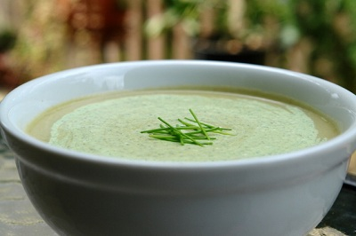

# Leek and potato soup

*Potage Parmentier*

**Serves:** 6

## Ingredients
- 50 grams butter
- 1 onion (finely chopped)
- 3 leeks (white part only, sliced)
- 1 celery stalk (finely chopped)
- 1 garlic clove (finely chopped)
- 200 grams potatoes (chopped)
- 750 ml chicken stock
- 220 ml whipping cream
- 2 tablespoons chives (chopped)

## Method
1. Melt the butter in a large saucepan and add the onion, leek, celery and garlic.
1. Cover the pan and cook, stirring occasionally over a low heat for 15 minutes, or until the vegetables are softened but not browned.
1. Add the potato and stock to the pan, and bring to the boil.
1. Immediately reduce the heat to low and simmer, uncovered for 20 minutes.
1. Move the pan off the heat, and allow to cool slightly, then purée in a blender.
1. Return the soup to the pan, and bring back to the boil, pour in the cream and check for seasoning.
1. Serve either hot or well chilled, and garnish with chives.